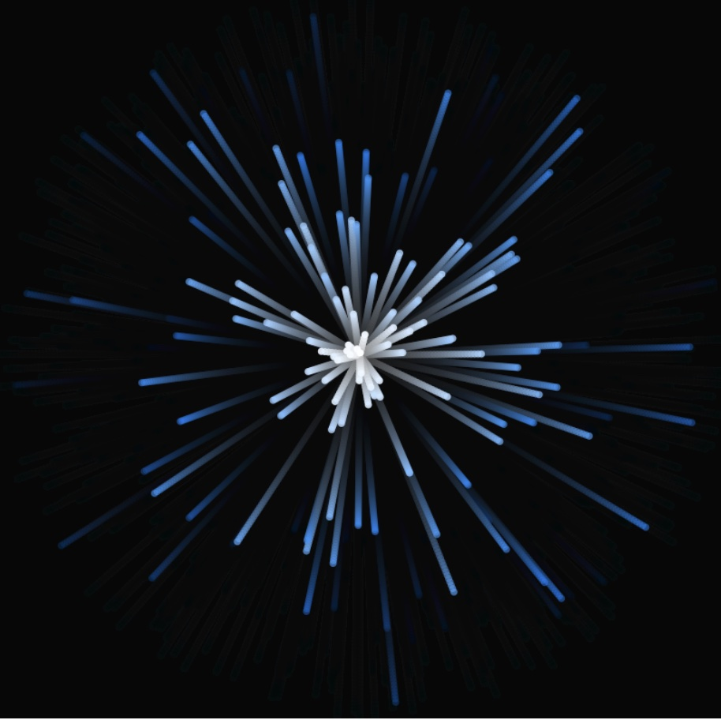
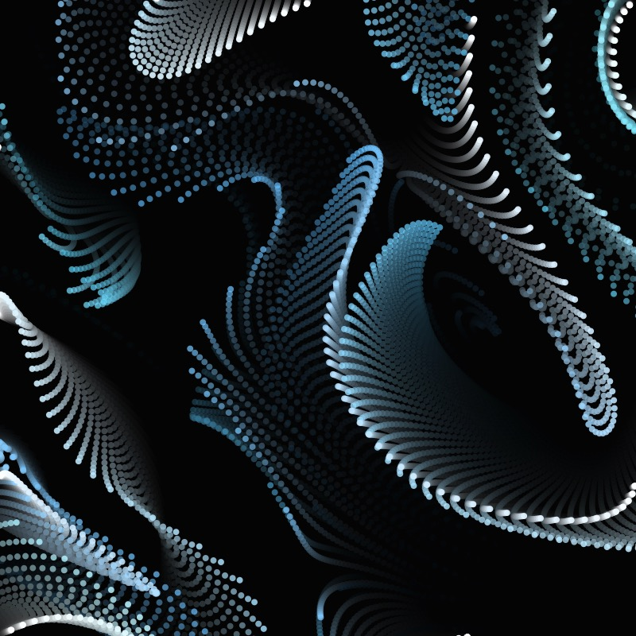

# Particle System with curl noise in P5.js

I have used Daniel Shiffman's code from [Simple Particle System Coding Challenge](https://thecodingtrain.com/challenges/78-simple-particle-system) and [Open Simplex Noise video](https://thecodingtrain.com/tracks/noise/open-simplex-noise) to port Robot Bobby's [Curl Particles youtube tutorial](https://www.youtube.com/watch?v=gvMNixP1S5o) visualization to P5.js.

I am adding some curve to the path of the particles using the getCurl function, by passing in the x and y position of the particle as well as a scaled value for the frame rate.

`getCurl(x, y, f) {`  
 `const delta = 0.01;`  
 `let n1 = this.noise.noise3D(x + delta, y, f);`  
 `let n2 = this.noise.noise3D(x - delta, y, f);`  
 `const cy = -(n1 - n2) / (delta * 2);`  
 `n1 = this.noise.noise3D(x, y + delta, f);`  
 `n2 = this.noise.noise3D(x, y - delta, f);`  
 `const cx = (n1 - n2) / (delta * 2);`  
 `return createVector(cx, cy);`  
`}`

You can learn more about curl noise from this article by [Keith Peters](https://www.bit-101.com/blog/2021/07/curl-noise/).

In the animation, the particle velocity is set to zero (suggested by Robot Robby) and the alpha on the background is set to 0.1 which creates trails. I am adding the particles in the 4 corners of the canvas.

<!-- IMAGE-LIST:START - Do not remove or modify this section -->
<!-- prettier-ignore-start -->
<!-- markdownlint-disable -->
<table>
  <tbody>
    <tr>
      <td align="center"><a href="https://editor.p5js.org/kfahn/sketches/ePi0_EyKP">  <b>Particle system w/ curl noise </b></a></td>
      <td align="center"> <b>Particle system w/o curl noise </b></a></td>
     <td align="center"><a href="https://editor.p5js.org/kfahn/sketches/2IjCZHU4P">  <b>Particle system animation </b></a></td>
    </tr>
  </tbody>
</table>

<!-- markdownlint-restore -->
<!-- prettier-ignore-end -->

<!-- IMAGE-LIST:END -->

