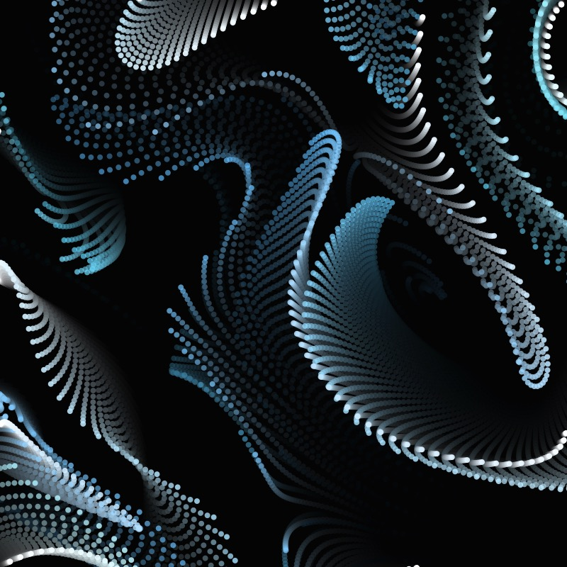

# Particle System with curl noise in p5.js

Particle sytem with curl noise based on Daniel Shiffman's [Simple Particle System Coding Challenge](https://thecodingtrain.com/challenges/78-simple-particle-system) and [Open Simplex Noise video](), and Robot Bobby's [Curl Particles youtube tutorial](https://www.youtube.com/watch?v=gvMNixP1S5o)

You can learn more about curl noise from this article by [Keith Peters](https://www.bit-101.com/blog/2021/07/curl-noise/).

  
[P5 sketch](https://editor.p5js.org/kfahn/sketches/ePi0_EyKP)

## This sketch eliminates particle velocity, as suggested by Robot Robby. I am adding the particles in the 4 corners of the canvas.

[P5 sketch](https://editor.p5js.org/kfahn/sketches/2IjCZHU4P)

## Here is a GIF of the animation (not a perfect loop, though).

